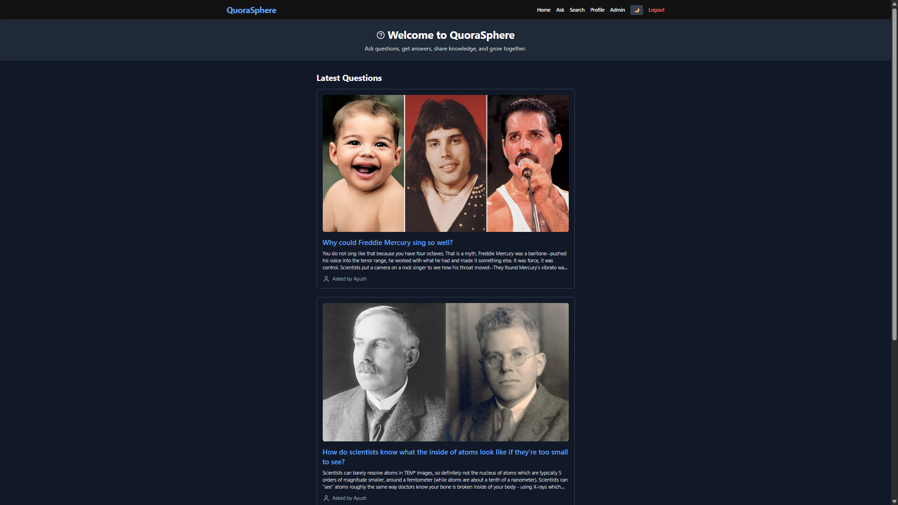
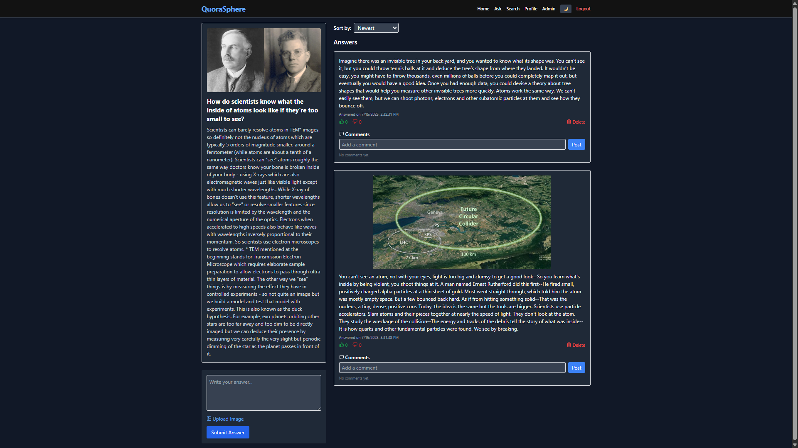
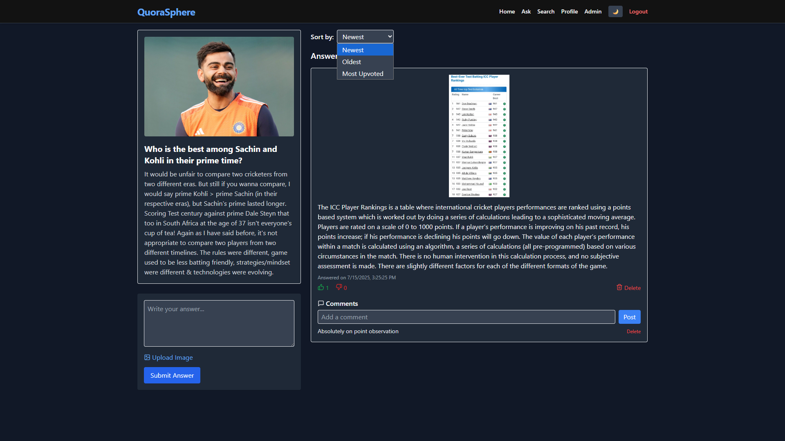
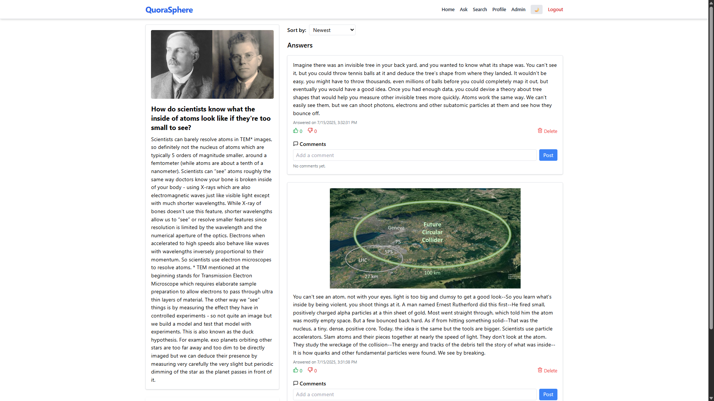
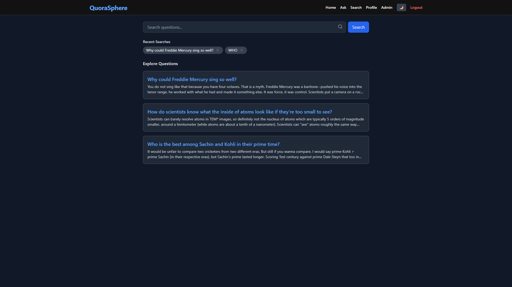
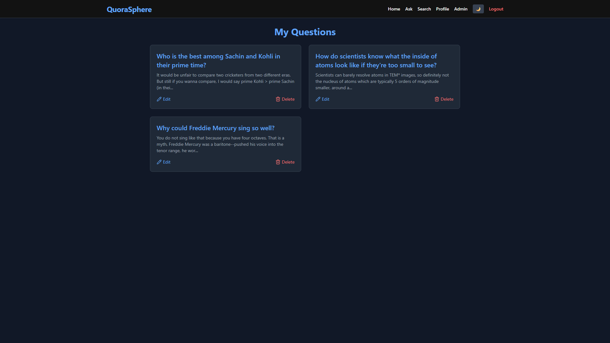
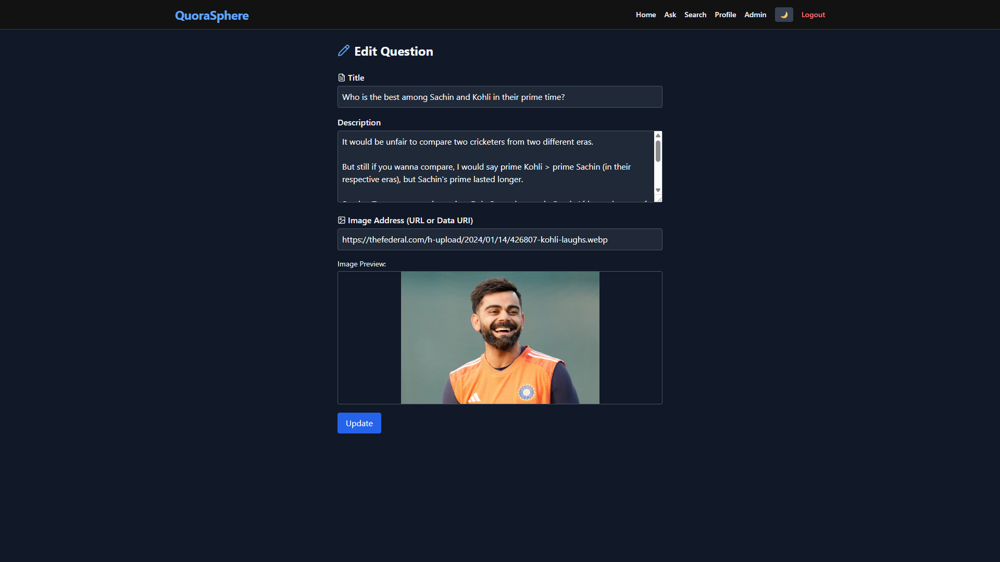
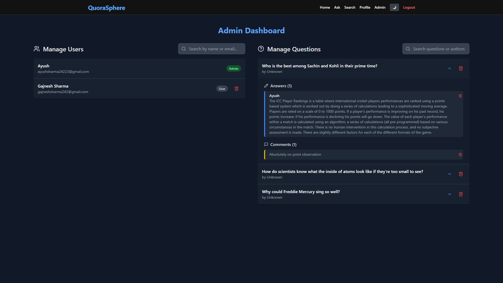
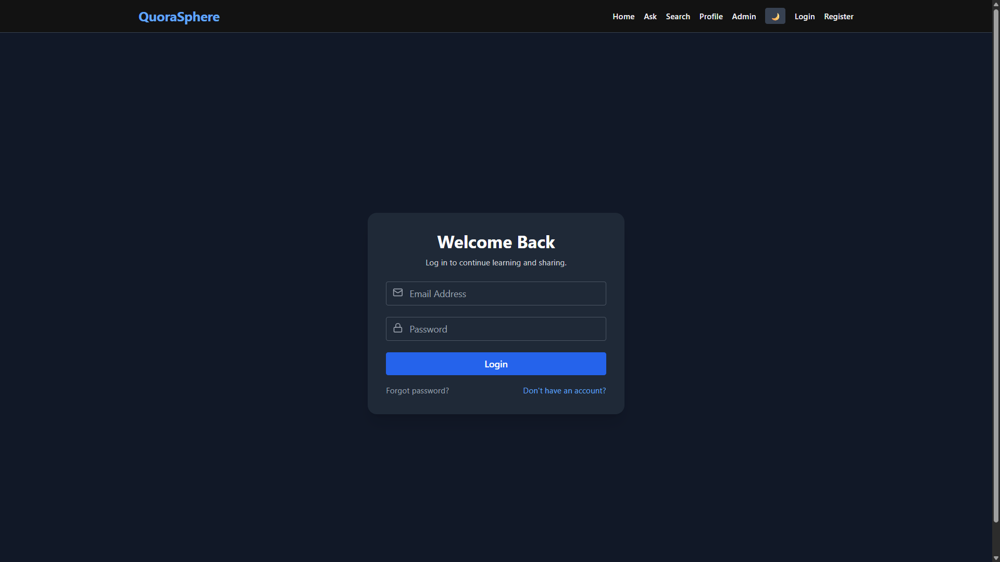
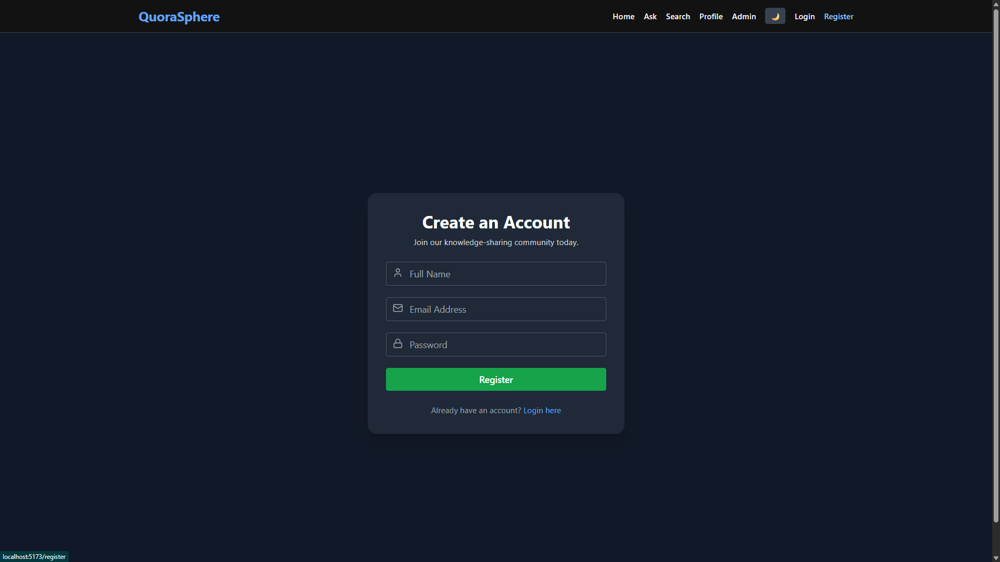

# 🧠 QuoraSphere - Quora Clone Project

A full-stack Q&A platform built with **React**, **Express**, **MongoDB**, and **Tailwind CSS**. Users can register, post questions, answer others' queries with optional images (upload or URL), comment on answers, and interact through upvotes/downvotes. An **Admin Dashboard** allows control over users and content, ensuring community moderation.

---


## 🚀 Features

### 👥 User Authentication
- Register and Login using JWT-based authentication
- Secure routes with role-based access (User/Admin)

### ❓ Questions
- Post questions with optional image upload or image URL
- View all questions in a clean and sorted feed

### ✍️ Answers
- Post answers with image upload or paste an image URL
- Answer preview with image modal for better UX
- Delete your own answers

### 🔼 Voting System
- Upvote and downvote answers
- Sort answers: `Newest`, `Oldest`, or `Most Upvoted`

### 💬 Comments
- Comment under any answer
- Delete your own comments

### 🛡️ Admin Dashboard
- Admin can view all users, questions, answers, and comments
- Admin can delete any content for moderation
- Expand/collapse answers/comments
- Dark mode support

### 🎨 UI/UX
- Responsive design with **Tailwind CSS**
- Smooth animations using **Framer Motion**
- Crisp icons with **Lucide Icons**
- Modal-based confirmations and image previews
- Fully mobile-responsive

---

## 🛠️ Tech Stack

| Frontend         | Backend         | Database     | Styling        | Other Tools    |
|------------------|------------------|--------------|----------------|----------------|
| React.js         | Node.js + Express| MongoDB Atlas| Tailwind CSS   | Framer Motion  |
| React Router DOM | JWT (Auth)       | Mongoose     | Lucide Icons   | Multer (Uploads)|

---


### Home Page


### Question Detail Page


### Question Detail Page


### Question Detail Page


### Search Question Page


### Profile Page


### Edit Question Detail Page


### Admin Dashboard Detail Page


### Login Page


### Register Page


---

## 🧪 Folder Structure
QuoraSphere/
│
├── client/ # React frontend
│ ├── src/
│ │ ├── components/ # Reusable UI components
│ │ ├── context/ # Auth and global state
│ │ ├── pages/ # Page components (Home, Ask, etc.)
│ │ └── App.jsx # Root component
│ └── vite.config.js # Vite config
│
├── server/ # Express backend
│ ├── controllers/ # Logic for each route
│ ├── models/ # Mongoose schemas
│ ├── middleware/ # Auth & error handling middleware
│ ├── routes/ # Express route handlers
│ ├── uploads/ # Uploaded images
│ └── server.js # Main server entry
│
├
├
├── README.md # Project documentation

---

## 🛠️ How to Run Locally

### ⚙️ Prerequisites

- Node.js and npm installed
- MongoDB Atlas database (or local MongoDB)
- Git

### 📦 Backend Setup

1. Navigate to the server directory:
   ```bash
   cd server
   
   npm install

   MONGO_URI=your_mongodb_connection_string
   JWT_SECRET=your_jwt_secret
   PORT=5000

   npm start
   ```

 ### 💻Frontend Setup

 2.Navigate to the client directory:
   ```bash
    cd client
   npm install
   npm run dev
   ```
